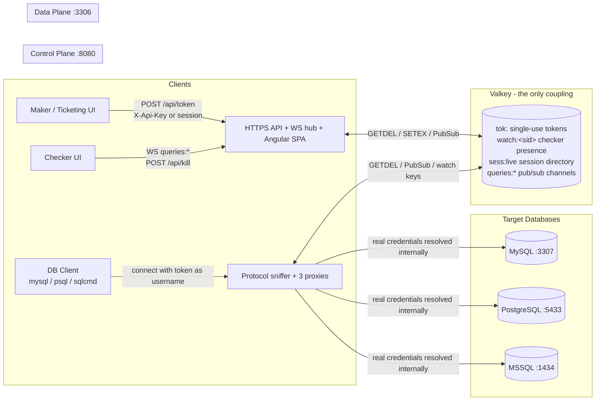

# Page 1 — Architecture Overview

## What this system is

A **zero-trust Just-in-Time (JIT) database access gateway**. Thick DB clients (mysql, psql, sqlcmd, IDE tools) never see real database credentials. Instead they obtain a short-lived (5-minute), **single-use token** from an external ticketing UI, connect through a shared TCP proxy, and are audited live on every query they run.

The system is split into two planes coupled **only through Valkey**:

- **Control plane** (`:8080`) — HTTPS REST API, WebSocket hub for checkers, Angular SPA.
- **Data plane** (`:3306`) — the shared TCP listener that terminates the client connection, authenticates the token, connects to the real database, relays SQL byte-exactly, and publishes audit events.

## Architecture diagram

## Zero-trust principles

1. **No credentials to clients.** The only thing a maker ever holds is a single-use token. The real DB username/password is resolved inside the data plane (config file or a credential API — never returned to the client).
2. **Single-use, time-boxed tokens.** Each token is consumed atomically (Valkey `GETDEL`) on first connect. A second connect with the same token is rejected. Tokens expire after 300 seconds.
3. **Read/write enforcement.** Read-write access requires a live checker watching the session (see [Page 4 — Write-Gating](04-write-gating.md)).
4. **Full audit.** Every query is logged with context (username, ticket, db user, database, statement type, status, session). Query *output* capture is behind a configuration flag.
5. **Isolation between planes.** The control plane cannot reach the data plane over HTTP. All signalling (tokens, kill commands, events) flows through Valkey.

## Component map

| Component | Role |
|---|---|
| Control plane API | `/api/login`, `/api/token`, `/api/sessions`, `/api/kill`, WS hub auth |
| Token store (Valkey) | `tok:<id>` single-use tokens (GETDEL), `sess:ui:` UI sessions |
| Session directory (Valkey) | `sess:live:<sid>` heartbeat-refreshed records, `watch:<sid>` checker presence |
| Event channels (Valkey) | `queries:<user>`, `queries:ticket:<t>`, `queries:sess:<sid>` |
| Data plane proxies | MySQL (server-first handshake), PostgreSQL (client-first), MSSQL (TDS prelogin + Login7) |
| Credential resolution | `config` (file) or `api` (external credential service) — see [Page 5](05-credential-retrieval-api.md) |

## Connection creation in one sentence

A caller asks the control plane for a token (`POST /api/token`); the token is a *promise* of a DB connection. When a client connects to `:3306` with that token as the username, the data plane validates it, resolves the real credentials, opens the backend connection, and the session is live — with a checker-visible entry from the moment the token is issued. Details on [Page 2](02-creating-db-connections.md).
