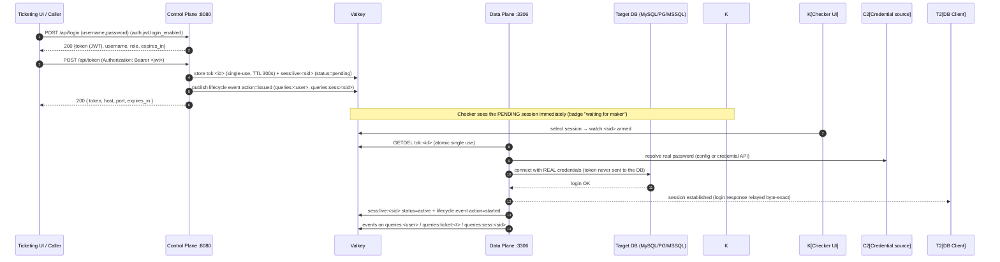

# Page 2 — Creating DB Connections (API)

> **This page describes how the gateway RECEIVES API calls to create new DB connections.** It is one of the two most likely surfaces to change — read the contracts carefully before editing.

There are two halves to "creating a connection":

1. **The API half** — a caller (the ticketing UI, a CI job, another service) asks the control plane to mint a token. This is the *authorization* for one connection.
2. **The wire half** — a DB client connects to the shared listener `:3306` presenting the token. The data plane validates it and opens the real backend connection.



## 2.1 Receiving the token request — `POST /api/token`

| Item | Value |
|---|---|
| Endpoint | `POST /api/token` (HTTPS on `:8080`) |
| Authentication | `Authorization: Bearer <jwt>` — a self-issued login JWT (`POST /api/login`) or an external JWT signed with the same `auth.jwt.secret` (the control-plane `X-Api-Key` was retired). See [Page 9 — JWT & Roles](jwt-auth-conversion.md) |
| Content-Type | `application/json` |

### Request body

```json
{
  "username": "admin",
  "ticket_id": "TKT-1234",
  "db_type": "mssql",
  "db_user": "rw_user",
  "db_ip": "127.0.0.1",
  "db_port": "1434",
  "access": "write"
}
```

| Field | Required | Meaning |
|---|---|---|
| `username` | no | Must match the bearer JWT's subject or be omitted — the token is ALWAYS issued for the authenticated principal (mint-for-others is rejected) |
| `ticket_id` | yes | Approval/change ticket — required since Phase 6; missing → `400` |
| `db_type` | yes | `mysql` \| `postgres` \| `mssql` \| `oracle` |
| `db_user`, `db_ip`, `db_port` | yes | Target connection parameters (the `db_presets` allowlist in `configs/control.yaml` decides the resolved `access` level) |
| `mode` | no | Token flavor: `single-use` (default) \| `session` (multi-connect, IP-locked, revocable — see RUN.md §3) |
| `idle_seconds` | no | Per-token data-plane idle override (0/absent = the data-plane default) |

`access` is resolved from the matching `db_presets` entry (absent = read). A **checker**-role
principal is limited to read-access mints — `POST /api/token` for a write preset answers **403**
(`checker role limited to read-only tokens`).

### Response — `200 OK`

```json
{
  "token": "sess_3dbeca423e...",
  "host": "127.0.0.1",
  "port": "3306",
  "expires_in": 300
}
```

| Field | Meaning |
|---|---|
| `token` | The single-use token. **The client uses it as the DB username.** Format `sess_<32 hex>`. TTL 300 s. |
| `host` / `port` | The shared Data Plane public listener (from `configs/control.yaml` `api.data_plane_*`) — same port for every protocol |
| `expires_in` | Seconds until expiry (`-1` for infinite session-mode tokens) |

### Error responses

| Status | Meaning |
|---|---|
| `400` | Missing/invalid fields (no `ticket_id`, unknown `db_type`, body username ≠ bearer subject) |
| `401` | Missing/invalid/expired/denylisted bearer JWT |
| `403` | Role gate: a checker-role principal minting a write-access token |
| `422` | Unknown `db_type` value |

## 2.2 Side effects of a successful token issue

The control plane does three things before responding:

1. **Stores the token** — `tok:<id>` with TTL 300 s; consumed atomically by `GETDEL` on first use.
2. **Creates a pending session record** — `sess:live:<sid>` with `status: pending` (60 s heartbeat TTL). It becomes visible in `GET /api/sessions` immediately, **before any connect**.
3. **Publishes a lifecycle event** — `kind=session`, `action=issued`, on `queries:<user>` and `queries:sess:<sid>`. The checker UI shows it as a selectable session with a "waiting for maker" badge.

> This "session listed at token time" behaviour is what resolved the original maker/checker deadlock: a checker can select and watch the session **before** the maker ever connects.

## 2.3 The wire connect — using the token

A DB client connects to the shared listener with the token **as the username** (any password is accepted and ignored):

```bash
# MySQL
mysql -h 127.0.0.1 -P 3306 -u sess_3dbeca423e... -p <anything> -e "SELECT ..."
# PostgreSQL
psql "host=127.0.0.1 port=3306 user=sess_3dbeca423e... password=x dbname=appdb"
# MSSQL (sqlcmd v18)
sqlcmd -S 127.0.0.1,3306 -U sess_3dbeca423e... -P x -N o -Q "SELECT ..."
```

### Protocol detection (first byte of the connection)

| First client byte | Protocol |
|---|---|
| `0x12` | MSSQL (TDS PRELOGIN) |
| `0x00` | PostgreSQL |
| silence (200 ms) | MySQL (server-first handshake) |

### What happens inside the data plane

1. **Validate** — `GETDEL tok:<id>`: atomic, single-use. Expired/consumed/wrong-protocol tokens get a clean, client-readable auth error (MySQL `1045`, PG `FATAL 28000`, MSSQL login-failure token).
2. **Resolve real credentials** — from config or the credential API ([Page 5](05-credential-retrieval-api.md)). The password lives only in memory for the connect call; it is never logged, stored, or sent to the client.
3. **Backend login** — the proxy performs the real login to the target DB with the real credentials (MySQL handshake, PG startup, MSSQL prelogin+Login7), then relays the login response **byte-exact** to the client.
4. **Session live** — `sess:live:<sid>` becomes `status: active` (with `db`, `db_user`, `db_type`, timestamps); lifecycle event `action=started`; subsequent events fan out to `queries:<user>`, `queries:ticket:<t>`, `queries:sess:<sid>`.
5. **Teardown** — on client or backend close: `sess:live:<sid>` deleted, lifecycle event `action=ended`.

## 2.4 Listing sessions — `GET /api/sessions`

Returns exactly: `{session_id, username, db_user, db_type, db, status, started_at, last_seen}` — one entry per live (or pending) session. Used by the checker dashboard to populate the session selector.

## 2.5 Kill — `POST /api/kill`

| Field | Meaning |
|---|---|
| `session_id` | Which session to act on |
| `mode` | `query` (abort the running query, session survives) or `connection` (drop the whole connection) |

See [Page 3](03-checker-sessions-kill.md).
