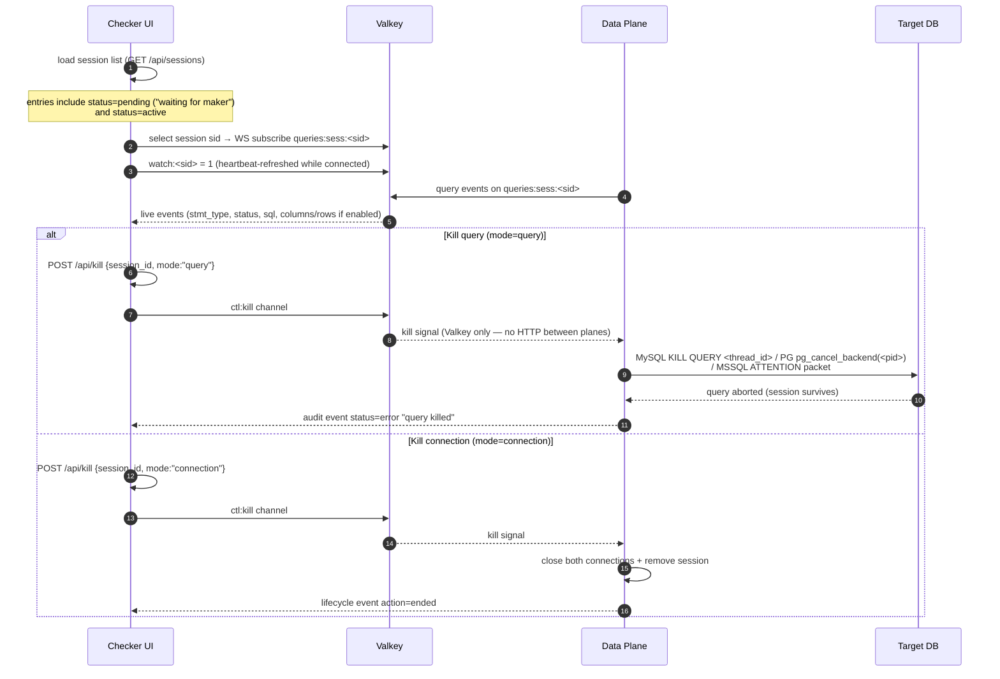

# Page 3 — Checker Sessions & Kill

## What the checker does

The checker dashboard (Angular SPA, `:8080`) is a **monitor + kill switch**. It shows live (and pending) sessions, lets the checker select one, streams that session's queries in real time, and provides two kill actions.

## Session selector

- Lists sessions from `GET /api/sessions`: `username · db_user · db · session_id` with a **"waiting" badge** when `status=pending` (token issued, maker not yet connected).
- Selecting a session:
  - subscribes the WS feed to `queries:sess:<sid>` (per-session channel — other sessions' events are **isolated**);
  - arms the `watch:<sid>` presence key (heartbeat-refreshed; deleted on disconnect).

## Live feed

Every query event carries: `username`, `ticket_id`, `db_user`, `db`, `db_type`, `stmt_type` (`select|insert|update|delete|other`), `status` (`ok|error`), `session_id`, `sql`. When output capture is enabled (`log_query_output: true`), it also carries `columns`, `rows` (capped: 100 rows, 512 chars/cell, 64 KB/event), `row_count`, `truncated`.

Events publish to **three channels**: `queries:<user>`, `queries:ticket:<t>`, `queries:sess:<sid>`.

## Two-level kill

| Mode | Mechanism per protocol | Session survives? |
|---|---|---|
| `query` | MySQL: `KILL QUERY <thread_id>` via a second connection · PG: `pg_cancel_backend(<pid>)` · MSSQL: TDS **ATTENTION** packet on the live connection (the proxy swallows the attention-ack so the client's protocol state stays clean) | ✅ yes — the maker can keep working |
| `connection` | Close the client + backend connections; delete `sess:live:<sid>`; emit `action=ended` | ❌ session ends |

- Kill signals flow **checker → control → Valkey `ctl:kill` channel → data plane** (Pub/Sub). There is no HTTP between the planes.
- A kill-query on a session with no query in flight is refused (idle sessions are not affected).
- Killing one session never affects other sessions (per-session isolation).

## API reference — `POST /api/kill`

| Field | Type | Required | Meaning |
|---|---|---|---|
| `session_id` | string | yes | Target session |
| `mode` | string | no | `query` (default) or `connection` |

| Response | Meaning |
|---|---|
| `202 {"killed":"queued"}` | Kill signal accepted |
| `400` | Missing `session_id` |
| `502` | Publish failed |
