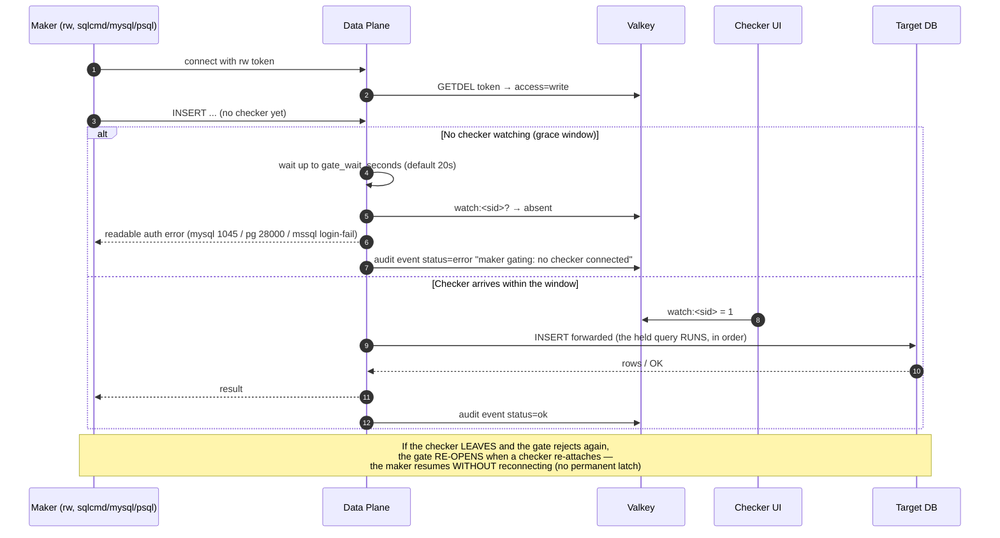

# Page 4 — Write-Gating (Maker–Checker)

## The rule

A maker with **read-write** access (`access: write` on the token) **cannot execute any SQL unless a checker is connected to their session**. Read-only makers are never gated.

The gate is enforced **inside the data plane**, per command, before a single SQL byte is forwarded to the database.

## How the gate works

1. **Watch presence** — while a checker is connected to a session, the checker hub keeps a heartbeat-refreshed `watch:<sid>` key in Valkey; it is deleted on disconnect.
2. **Per-command check** — for every SQL-executing command on a `access: write` session, the data plane checks `watch:<sid>` *before* forwarding. (MySQL/PG: query commands; MSSQL: TDS batch `0x01` / RPC `0x03` — control messages are never gated.)
3. **Grace window** — if unwatched, the command is **held**, not rejected instantly: `gate_wait_seconds` (default **20**, `0` = reject immediately; env `ZT_GATE_WAIT_SECONDS`). If a checker attaches within the window, the held command(s) flush in order.
4. **Timeout** — no watcher by the deadline → the client receives a readable auth-class error and an audit event (`status=error`, message `maker gating: no checker connected...`). Nothing was executed; no row can land.
5. **Re-open, no latch** — a later watcher **does** re-open the gate: the maker's next command runs, same connection, no reconnect required. (The permanent latch from an earlier design was removed — a returning checker unblocks the session.)

## Separation of duties (checker ≠ maker) — 2026-08-17

The checker who arms the gate for a session **cannot be the session's maker**. At WebSocket attach
(`channel=sess:<sid>`) the control plane compares the checker's session username against the maker
recorded in the session directory record (`sess:live:<sid>`, written at token issue):

- **Same user** → the connection is closed with a **1008 policy-violation** close and **no `watch:<sid>` lease is created** — the maker can never open their own write gate, in either browser or CLI flows.
- **Unknown/expired session record** → rejected the same way (fail-closed): a lease may only exist for a real session whose maker is known.
- **Different user** → watch presence is armed as usual (heartbeat-refreshed lease).

Because the data-plane gate only ever probes `watch:<sid>:*` presence, and the only writer of those keys
is the (now identity-checked) WS attach, this closes the self-approval path end to end. The audit row's
`checker_username` is only written for accepted watches. The checker dashboard surfaces the rejection
as a banner ("Feed rejected: … — this session cannot be watched by its maker").

## Behaviour matrix

| Scenario | Outcome |
|---|---|
| rw maker, no checker ever | every SQL command → grace wait → readable error + audit `status=error`; **rows never land** |
| rw maker, checker attaches during grace | held command runs; subsequent commands flow while watched |
| rw maker, checker attaches after a rejection | next command runs (gate re-opened) |
| rw maker, checker disconnects mid-session | next command → grace wait → error again (enforcement is per-command) |
| ro maker | never gated — queries flow with no checker |

## Error surface per protocol

| Protocol | Blocked-command error |
|---|---|
| MySQL | `ERROR 1045 (42000): maker gating: no checker connected to session <sid>` |
| PostgreSQL | `FATAL 28000: maker gating: no checker connected to session <sid>` |
| MSSQL | sqlcmd-readable login-failure style error token with the same message |

## Configuration

| Key | Env | Default | Meaning |
|---|---|---|---|
| `gate_wait_seconds` | `ZT_GATE_WAIT_SECONDS` | `20` | Grace window for a watcher; `0` = immediate reject |

## The session-listing piece

Tokens carry a session id **stamped at issue time**; the session appears in the checker's list as `pending` (with a "waiting for maker" badge) **before the maker connects**. This lets a checker arm the watch *first* — the flow that originally deadlocked (checker couldn't select a session until the maker connected, but the maker's first query was blocked until a checker watched) now works in either order.
