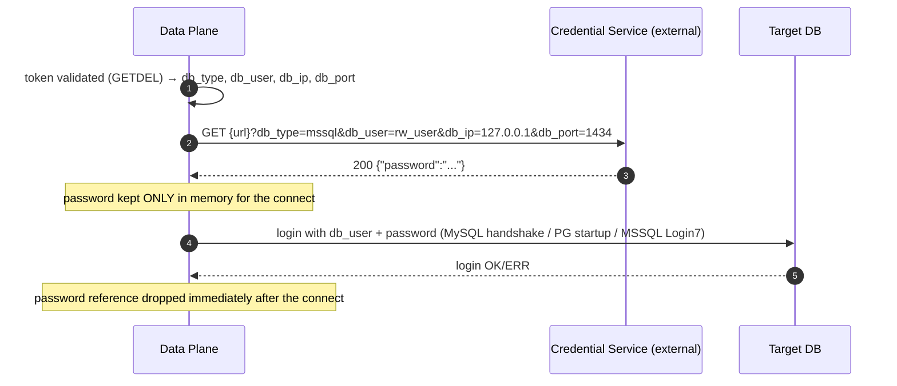

# Page 5 — Credential Retrieval API (Withdrawing DB Passwords)

> **This page describes how the gateway CALLS OUT to an external API to withdraw DB passwords.** This is the section most likely to be modified — the contract below is the source of truth for anyone changing it.

> **Key disambiguation (JWT conversion):** the `X-Api-Key` on THIS page is the
> **data plane's** key to its vault (`credentials_api.api_key` /
> `ZT_CREDENTIALS_API_API_KEY`) — a different, still-live credential. The
> control-plane API key (`ZT_API_API_KEY` / `X-Api-Key` on `/api/*`) was
> retired in the 2026-09-05 JWT conversion — see
> [Page 9 — JWT & Roles](jwt-auth-conversion.md).

## When it happens

The data plane needs the **real DB password** exactly once per session: when it opens the backend connection after validating the maker's token. In `credentials_source: api` mode the password is fetched live from an external credential service. It exists **in memory only, for that one connect call** — it is never stored, logged, or sent back toward the client.



## Configuration

```yaml
# configs/data.yaml
credentials_source: api          # config | api   (env ZT_CREDENTIALS_SOURCE)
credentials_api:
  url: "https://vault.example.internal/creds"   # env ZT_CREDENTIALS_API_URL
  api_key: "..."                                # env ZT_CREDENTIALS_API_KEY
  timeout_seconds: 5                            # env ZT_CREDENTIALS_API_TIMEOUT_SECONDS (default 5)
```

| Key | Env | Default | Meaning |
|---|---|---|---|
| `credentials_source` | `ZT_CREDENTIALS_SOURCE` | `config` | `config` = passwords from `configs/data.yaml`; `api` = live fetch |
| `credentials_api.url` | `ZT_CREDENTIALS_API_URL` | — | Base URL of the credential service |
| `credentials_api.api_key` | `ZT_CREDENTIALS_API_KEY` | — | Auth header value |
| `credentials_api.timeout_seconds` | `ZT_CREDENTIALS_API_TIMEOUT_SECONDS` | `5` | HTTP timeout |

**Fail-fasts** (config load errors, the service refuses to start):

- `credentials_source: api` with an empty `url` → error naming `credentials_api.url`.
- Unknown `credentials_source` value → error.

## Request contract

```
GET {url}?db_type={db_type}&db_user={db_user}&db_ip={db_ip}&db_port={db_port}
X-Api-Key: {api_key}
```

| Query parameter | Example | Source |
|---|---|---|
| `db_type` | `mysql` / `postgres` / `mssql` | token payload |
| `db_user` | `ro_user` | token payload (the real DB login, NOT the maker's username) |
| `db_ip` | `127.0.0.1` | token payload |
| `db_port` | `3307` | token payload |

Example:

```bash
curl -sS \
  -H "X-Api-Key: $ZT_CREDENTIALS_API_KEY" \
  "https://vault.example.internal/creds?db_type=mssql&db_user=rw_user&db_ip=127.0.0.1&db_port=1434"
```

## Response contract

| Status | Behaviour |
|---|---|
| `200` | Body must be JSON with a `password` field: `{"password":"..."}` — used for the connect, then dropped |
| non-`200` | **Status-only error**: the body is drained (bounded at 1 MiB) and discarded — the status code is what matters. The client gets a clean "backend unavailable" auth-class error; **the response body is never surfaced, logged, or stored** |

## Hygiene rules (hard requirements)

1. **Memory-only** — the password is held in a local variable for the duration of the connect call and never persisted.
2. **Never logged** — passwords (and non-200 bodies, which could echo them) must not appear in any log line.
3. **Never sent client-ward** — the maker's client only ever sees the token; the resolved password never travels toward the client.
4. **Bounded reads** — response bodies are read with a hard 1 MiB cap.

## Runtime identity key (internal)

Internally the resolver keys credentials as `dbtype:user@ip:port` (e.g. `mssql:rw_user@127.0.0.1:1434`). This key format is used by the config-mode resolver and is what the API-mode resolver constructs its query from — if you add a new database type or change the addressing scheme, this key shape is the one place to update.

## Testing the mode

- Config-mode: credentials live in `configs/data.yaml` under `dbtype:user@ip:port` keys.
- API-mode: a live test spins a stub credential server (`GET /creds?db_type=...&db_user=...&db_ip=...&db_port=...` with `X-Api-Key`) and runs a full session through it — verifying the password was fetched, used, and absent from all logs.
