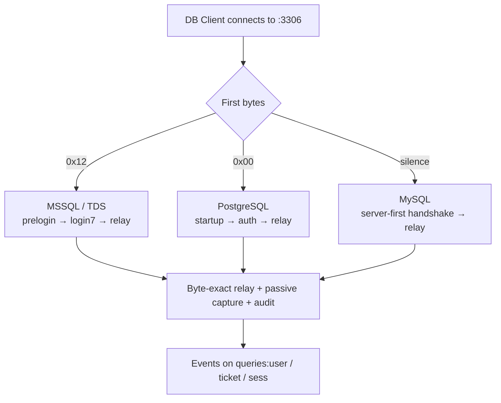

# Page 6 — Protocols, TLS & Security

## Wire protocols on one port

The data plane listens on a single TCP port (`:3306`) and detects the protocol from the first bytes the client sends:

| First client byte | Protocol | Handshake style |
|---|---|---|
| `0x12` | **MSSQL** (TDS) | Client-first PRELOGIN → encryption negotiation → Login7 (username = token) |
| `0x00` | **PostgreSQL** | Client-first startup; token as username |
| silence (200 ms) | **MySQL** | Server-first handshake; token as username |



- **Byte-exact relay**: client↔backend traffic is forwarded verbatim; the sniffed copy (for classification/capture) is parsed separately and never alters the stream.
- **Statement classification**: first keyword → `select` / `insert` / `update` / `delete` / `other`.
- **Output capture** (only with `log_query_output: true`): columns + up to 100 rows, cells capped at 512 chars, events capped at 64 KB, `truncated` flag set when caps are hit.
- **MSSQL specifics** (capture-derived): password obfuscation in Login7 is per-UTF-16LE-byte `nibble-swap ^ 0xA5`; the TLS handshake rides inside TDS type-0x12 packets while the Login7 itself is a bare TLS record and the login response comes back plaintext; the proxy-initiated ATTENTION ack is swallowed so the client's protocol state stays clean.

## TLS surfaces (all on/off via config)

| Surface | Config | Notes |
|---|---|---|
| Control plane HTTPS/WSS (`:8080`) | `http.tls.enabled` + cert/key files | API + WS hub + SPA |
| Data-plane wire TLS | `tls.enabled` + cert/key files | MySQL: SSLRequest handshake · PG: `'S'` response · MSSQL: prelogin encryption negotiation |
| Valkey connection | `valkey.ssl.*` | direct and sentinel modes |
| Valkey sentinel auth | `valkey.sentinel_password` | sentinel's own `requirepass`, independent of the master's `valkey.password`. Sentinels have **no ACL users** — a username is never sent (`AUTH <password>` only) |

`enabled: true` requires `cert_file` + `key_file` (fail fast if missing); absent/false = plaintext.

## Security model

1. **Tokens** — single-use (`GETDEL`), 300 s TTL, bound to one session id; presented as the DB username; any password value is ignored.
2. **No credentials to clients** — real DB passwords never leave the data plane ([Page 5](05-credential-retrieval-api.md)).
3. **Write-gating** — rw sessions require a watching checker; grace window + re-open semantics ([Page 4](04-write-gating.md)).
4. **Plane isolation** — control ↔ data communicate only through Valkey (tokens, `ctl:kill`, Pub/Sub). No HTTP between planes.
5. **Credential-API hygiene** — password memory-only, status-only error handling, bounded bodies (1 MiB), nothing logged.

## Audit & query logging

Every query is logged with context regardless of output capture:

```
username  ticket_id  db_user  db  db_type  stmt_type  status  session_id  sql
```

- `log_query_output: false` (default): context only — the SQL itself is included, but not the result rows.
- `log_query_output: true` (env `ZT_LOG_QUERY_OUTPUT`): adds `columns`, `rows`, `row_count`, `truncated`.
- Lifecycle lines (`session started/ended`) carry the same context minus SQL; ticket ids come from the token, never from wire events.
- Hygiene invariant enforced by tests: no token values, no passwords, anywhere in the logs.
