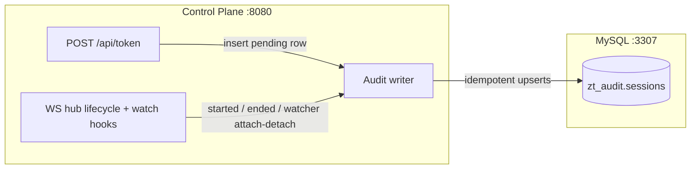

# Page 7 — Session Audit Persistence (MySQL)

> Feature added 2026-08-16. The gateway writes every connection's details to a MySQL audit database: sessions, the maker's username, and the checker's username when one is watching.

## What is stored

One row per session in `zt_audit.sessions`, written by the **control plane** (the only component that knows both the maker's identity and — via the checker hub — the watcher's identity).



## Schema (`zt_audit.sessions`)

| Column | Meaning |
|---|---|
| `session_id` | Unique (`sid-…`) — the upsert key |
| `username` | **Maker's** username (pinned: never overwritten by later updates) |
| `ticket_id` | The approval ticket |
| `db_type` / `db_user` / `db` | Target database details |
| `access` | `read` / `write` |
| `checker_username` | The **current** watcher — `NULL` when no checker is connected |
| `status` | `pending` → `active` → `ended` |
| `started_at` / `ended_at` | Session open/close timestamps (`DATETIME(3)`) |
| `last_seen` / `created_at` | Heartbeat/insertion timestamps |

The table (and database) are created automatically on startup when the feature is enabled.

## Lifecycle mapping

| Event | Row change |
|---|---|
| Token issued (`POST /api/token`) | INSERT `status=pending`, maker username, ticket, db fields |
| Maker connects (data plane validates the token) | UPDATE `status=active`, `started_at`, `db` |
| Checker attaches (watch `<sid>` set) | UPDATE `checker_username=<checker>` |
| Checker disconnects (watch deleted) | UPDATE `checker_username=NULL` |
| Session ends (client/backend closed) | UPDATE `status=ended`, `ended_at` |

> `checker_username` reflects the *current* watcher: it is set when a checker selects the session and cleared when that checker disconnects. History of who watched when is available from the event channels / logs.

## Configuration

```yaml
# configs/control.yaml
audit:
  mysql:
    enabled: false          # ZT_AUDIT_MYSQL_ENABLED — default off (no DB dependency)
    host: "127.0.0.1"       # ZT_AUDIT_MYSQL_HOST
    port: 3307              # ZT_AUDIT_MYSQL_PORT
    user: "..."             # ZT_AUDIT_MYSQL_USER
    password: "..."         # ZT_AUDIT_MYSQL_PASSWORD
    database: "zt_audit"    # ZT_AUDIT_MYSQL_DATABASE
```

| Behaviour | Detail |
|---|---|
| Enabled + missing field | Fail-fast at startup, naming the missing field |
| Enabled + MySQL unreachable | Fail-fast at startup (10 s ping) |
| Runtime write failure | **Non-fatal** — logged, token/connect flow continues (audit must never break access) |
| Disabled | Zero overhead — hooks are no-ops |

## Example audit trail

```sql
SELECT session_id, username, db_type, db, access, checker_username, status, started_at, ended_at
FROM zt_audit.sessions ORDER BY created_at DESC LIMIT 1;
```

```
+--------------------+-----------+---------+-------+--------+-----------------+--------+---------------------+---------------------+
| session_id         | username  | db_type | db    | access | checker_username | status | started_at          | ended_at            |
+--------------------+-----------+---------+-------+--------+-----------------+--------+---------------------+---------------------+
| sid-0ccf34e877...   | round2-…  | mysql   | appdb | read   | admin           | ended  | 2026-08-15 17:55:55 | 2026-08-15 17:56:43 |
+--------------------+-----------+---------+-------+--------+-----------------+--------+---------------------+---------------------+
```

## Relationship to the other surfaces

- **Live state** (current sessions) lives in Valkey `sess:live:<sid>` and is served by `GET /api/sessions` — see [Page 2](02-creating-db-connections.md).
- **This table is the durable history** — it keeps the completed trail (incl. ended sessions and who watched) after the live directory has expired.
