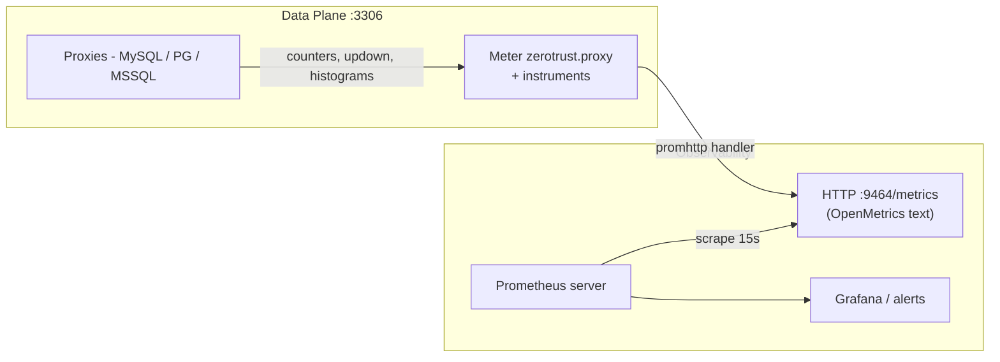

# Page 8 — OpenTelemetry Metrics (Prometheus)

> Feature added 2026-08-16. The **data plane** exposes OpenTelemetry metrics on an HTTP endpoint that a Prometheus server can scrape directly.

## How it works



- Instruments are wired at the exact operational moments (token validated/rejected, connection opened/closed, query published, gate blocked, kill issued, session/query durations).
- The endpoint serves **standard OpenMetrics text** (plus the usual `go_*` / `process_*` collectors) — point Prometheus at `http://<data-plane-host>:9464/metrics`.

## Configuration

```yaml
# configs/data.yaml
metrics:
  enabled: false                 # ZT_METRICS_ENABLED — default off
  listen: "0.0.0.0:9464"         # ZT_METRICS_LISTEN
  path: "/metrics"               # ZT_METRICS_PATH
```

- Enabled + invalid listen address or empty path → fail-fast at startup.
- Disabled → zero overhead (nil wrapper, one nil check per call site).
- When enabled, the plane logs `msg="metrics endpoint"` — that log line is the operational signal that observability is on.
- Metric names are namespaced `zerotrust_proxy_*` (e.g. `zerotrust_proxy_tokens_validated_total`).

## Instruments

| Family | Type | Attributes | Meaning |
|---|---|---|---|
| `zerotrust_proxy_tokens_validated_total` | counter | — | Token accepted (GETDEL success) |
| `zerotrust_proxy_tokens_rejected_total` | counter | `reason=invalid` | Token refused (expired/consumed/wrong-type all surface as `invalid` from the store) |
| `zerotrust_proxy_connections_total` | counter | `db_type`, `result=ok|rejected` | Connection attempts |
| `zerotrust_proxy_connections_active` | updowncounter | `db_type` | Currently open sessions |
| `zerotrust_proxy_queries_total` | counter | `db_type`, `stmt_type` (select/insert/update/delete/other), `status` (ok/error) | Queries relayed **and** gated (blocked commands count with `status=error`) |
| `zerotrust_proxy_gate_blocks_total` | counter | `db_type` | Write-gate rejections (always paired with a `queries_total{status=error}` increment) |
| `zerotrust_proxy_kills_total` | counter | `mode=query|connection` | Kill actions |
| `zerotrust_proxy_session_duration_seconds` | histogram | `db_type` | Session lifetime |
| `zerotrust_proxy_query_duration_seconds` | histogram | `db_type` | Command → response time |

> Note on blocked commands: a gated command increments **both** `gate_blocks_total` and `queries_total{stmt_type,status=error}` — the audit event it produces is a query event with an error status, so it is counted in both places.

## Example scrape

```bash
curl -s http://127.0.0.1:9464/metrics | grep zerotrust_proxy
```

```text
# HELP zerotrust_proxy_tokens_validated_total ...
# TYPE zerotrust_proxy_tokens_validated_total counter
zerotrust_proxy_tokens_validated_total 42
zerotrust_proxy_tokens_rejected_total{reason="invalid"} 3
zerotrust_proxy_connections_active{db_type="mysql"} 1
zerotrust_proxy_queries_total{db_type="mysql",stmt_type="select",status="ok"} 40
zerotrust_proxy_gate_blocks_total{db_type="mssql"} 2
zerotrust_proxy_kills_total{mode="connection"} 1
```

## Prometheus scrape config (example)

```yaml
scrape_configs:
  - job_name: "zt-data-plane"
    static_configs:
      - targets: ["<data-plane-host>:9464"]
```

## Testing / verification notes

- The live metric tests use the project's **go-mysql client** rather than the mysql CLI: the mysql CLI sends unsuppressible probe queries per connection (`select @@version_comment limit 1` + `select $$`), which pollute exact delta assertions. The go-mysql client sends exactly one `SELECT` per connection, giving clean +1 deltas.
- Dependency versions (all Apache-2.0): otel v1.45.0, otel/sdk/metric v1.45.0, otel/exporters/prometheus v0.67.0, prometheus/client_golang v1.24.1. The exporter is configured with `WithNamespace("zerotrust_proxy")` — without it, metric families are emitted **bare-named** (`tokens_validated_total`), which breaks Prometheus conventions and any `zerotrust_proxy_*` queries.
