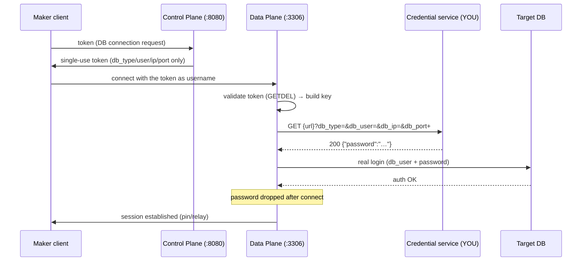

# Page 10 — Credential Retrieval API Contract (for the credential-service implementer)

> **Audience:** the team building the credential service ("vault") that the
> Project-D **data plane** calls to withdraw DB passwords. This page is the
> exact contract the data plane's client (`internal/proxy/creds.go`,
> `APICredResolver`) expects. Someone implementing the endpoint against this
> page only needs one shared secret and a route that answers `GET` — the
> client is already written and tested (`creds_test.go`).

## One-paragraph summary

When a maker's token is validated, the data plane opens a real DB
connection. The real password is **not** stored anywhere in Project-D config
or secrets — the data plane asks **your service** for it, once per
connection, with this call:

```
GET {credentials_api.url}?db_type=mysql&db_user=ro_user&db_ip=127.0.0.1&db_port=3307
X-Api-Key: <the shared key>
```

Answer `200` with `{"password":"..."}` and the data plane logs in, then
drops the password. Anything else — the password is never drawn and the
backend login fails cleanly.

## The request

| Aspect | Contract |
|---|---|
| Method | `GET` (no body) |
| URL | Exactly the endpoint configured in `credentials_api.url` — the query parameters below are **appended** by the client (any query already in the configured URL is preserved) |
| Path | Whatever the configured URL says (`/creds`, `/v1/passwords`, …) — the service owns its path |
| Auth | `X-Api-Key: <key>` header. The key is the data plane's `credentials_api.api_key` (`ZT_CREDENTIALS_API_API_KEY`), shared out-of-band. **Distinct from the retired control-plane `X-Api-Key`** — that key is gone (JWT conversion); this one is data-plane↔vault and still live |
| Timeout | Client-side 5 s (configurable `credentials_api.timeout_seconds`); the service may take much less — the request is one password lookup, not a search |
| Retries | **None** — the client makes exactly one attempt per connect. A failed draw = a failed session (safe, zero-trust posture) |
| TLS | **HTTPS is supported, and how it's trusted is configurable.** With no `credentials_api.tls` block the client uses the **system trust store** (`http.DefaultTransport`), which already covers a publicly-trusted certificate. For an **internal CA or self-signed** certificate set `tls.ca_file` (a PEM bundle *appended* to the system pool, so public and internal endpoints both keep working); `tls.min_version` pins the floor (1.2 default, 1.3 opt-in); `tls.require_https: true` refuses a plaintext URL; a `tls` block on a non-https URL is a load error, and a missing/invalid `ca_file` refuses to boot — never mid-session |

### Query parameters

| Parameter | Example | Meaning | Notes |
|---|---|---|---|
| `db_type` | `mysql` / `postgres` / `mssql` / `oracle` | Backend database type | comes from the maker's token payload |
| `db_user` | `ro_user` | **The real DB login** the connection will authenticate as | NOT the maker's username, NOT a ticket id |
| `db_ip` | `127.0.0.1` | Backend host (network-reachable address, not always a public IP) | |
| `db_port` | `3307` | Backend port | |

Values are percent-encoded by the client (standard `application/x-www-form-urlencoded` query encoding).

Canonical example:

```bash
curl -sS \
  -H "X-Api-Key: $ZT_CREDENTIALS_API_API_KEY" \
  "https://your-service.example.internal/creds?db_type=mssql&db_user=rw_user&db_ip=127.0.0.1&db_port=1434"
```

## The response

### 200 OK

```json
{ "password": "the-real-db-password" }
```

| Rule | Detail |
|---|---|
| Content type | JSON (`application/json`) |
| Required field | `password` — a **non-empty** string |
| Extra fields | Ignored (safe to include `expires_at`, `ttl`, counters…) |

A `200` with a missing, empty, or non-string `password` is treated as a
**failure** (the client errors: "empty password") — the backend login
fails cleanly. Be explicit: a service that returns "failed to resolve"
should answer a real error status, not `200 {"password":""}`.

### Any other status (304, 400, 401, 403, 404, 429, 500, …)

| Rule | Detail |
|---|---|
| Status is what matters | The client reports the status **code only** (e.g. `credential api: status 404 for mssql:rw_user@127.0.0.1:1434`) |
| Body is discarded | Drained (bounded at 1 MiB) and **never surfaced, logged, or stored** — so a body that echoes the password cannot leak. Don't bother writing a pretty error body for this client; a JSON error body is fine but unnecessary |
| Result | The session's backend connect fails with the canonical "backend unavailable" class of error; the maker's client sees a normal connection failure |

Recommended status semantics (not enforced, but they read cleanly):

| Status | Use it for |
|---|---|
| `400` | Malformed query (missing `<param>`) |
| `401` / `403` | Bad or missing `X-Api-Key` |
| `404` | Key format fine but no credential for that `db_type:user@ip:port` |
| `429` / `503` | Rate or outage — the client will surface a failed session; no back-off exists server-side |

## Lifecycle & security rules (the client side — bake these into your server design)

1. **Memory-only.** The password exists in the data plane's memory only for the connect call. Your service should assume the drawn password is used once and never cached by the client (it will be asked again for the next connection).
2. **Never logged.** Both sides: no password in logs, and (client-side) no response body in logs on non-200. Keep your service's request logs to the query parameters.
3. **Never client-ward.** The password never travels toward the maker's client — your service answers the data plane, and the data plane alone uses the password.
4. **Payload must match the endpoint.** `db_user` + `db_ip` + `db_port` identify exactly one backend login. A password that works for the requested target is the contract; don't return a different user's password (it would either fail login or silently change privilege semantics).
5. **Rotation-friendly.** The contract is stateless: the data plane has no cached password, so rotation is immediate on your side at any time.

## Sequence



## Integrating with Project-D (operator checklist)

1. **Out-of-band key exchange.** Agree one HS256-grade long random string as `ZT_CREDENTIALS_API_API_KEY` (32+ bytes; the same string goes into your service's API-key store).
2. **Set the data plane config** (`configs/data.yaml` or env):
   ```yaml
   credentials_source: api
   credentials_api:
     url: "https://your-service.internal.example/creds"
     # api_key: "${ZT_CREDENTIALS_API_API_KEY}"  # from .env, never committed
   ```
   Fail-fast: `credentials_source: api` with an empty `url` refuses to boot.
3. **Smoke test** (with your service running):
   ```bash
   curl -sS -H "X-Api-Key: $ZT_CREDENTIALS_API_API_KEY" \
     "https://your-service.internal.example/creds?db_type=mysql&db_user=ro_user&db_ip=127.0.0.1&db_port=3307"
   # → {"password":"…"}
   ```
4. **Full session test** — mint a token, connect via the data plane, run a
   query; then check the data plane logs contain **no** password and **no**
   vault response body.
5. **Negative test** — a `404` from your service surfaces as a clean
   "backend unavailable" with a 5-second bound, not a hang.

## Boundary notes

- **This endpoint is called once per backend connection.** A busy site does one lookup per session, not per query — cheap for the service, and a good reason to keep lookups O(1) (no DB scan of credential tables per call).
- **No affinity requirement** — any instance of your service can answer; the data plane does not care about instance identity or a session id.
- **The endpoint does not need maker/checker context.** The password draw is keyed solely by backend target (`db_type:user@ip:port`); identity, tickets and roles never reach this endpoint. (JWT-based auth *instead of* X-Api-Key on this endpoint is a possible later extension — see the Phases; not part of this contract.)
- **The `oracle` backend** uses the same resolver (`oracle:ro_user@…` keys) — the contract is uniform across the four wire protocols.

## References

- Client implementation: `internal/proxy/creds.go` (`APICredResolver`)
- Client tests: `internal/proxy/creds_test.go` (200/status-only/empty-password/network/fail-fast)
- Controller wiring: `cmd/data/main.go` (`buildCredResolver`)
- Config: `configs/data.yaml` (`credentials_source` / `credentials_api`)
- Page 5 of this set (data-plane perspective): [05-credential-retrieval-api.md](05-credential-retrieval-api.md)
