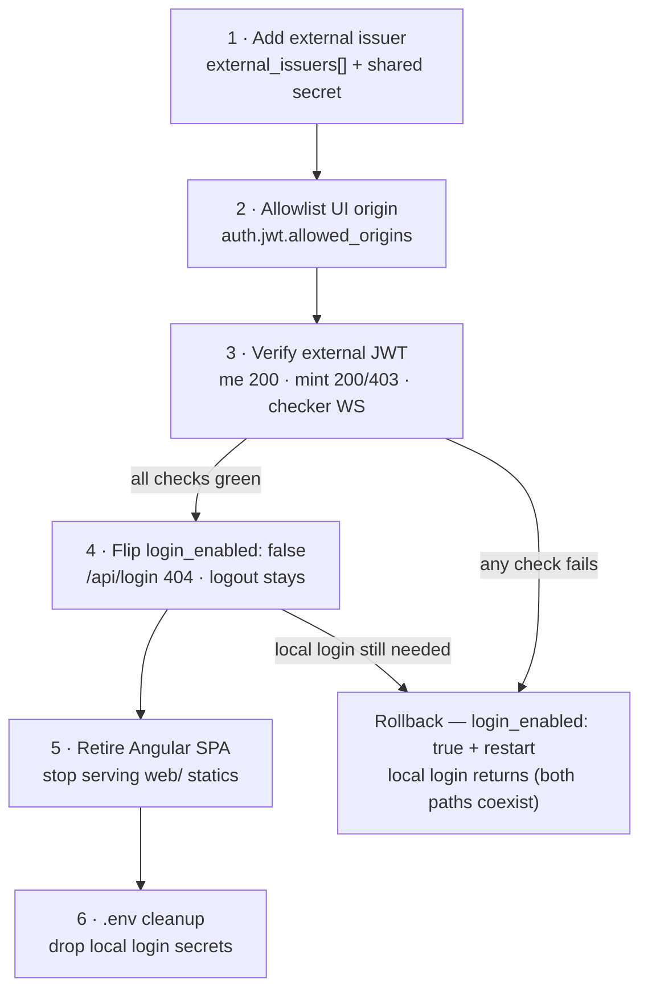

# Page 9 — JWT & Roles Auth Conversion (Control-Plane Authentication)

> **What this page covers.** The Control Plane's authentication model changed on
> 2026-09-05 from **cookie sessions + a control-plane API key** to **self-issued
> HS256 bearer JWTs with maker/checker roles**, and Phase 2 (same day) extended
> that model from a single self-issuer to **local login + trusted external JWT
> issuers** (`auth.jwt.external_issuers`, configurable claim mapping). This page
> is the operator-facing summary: the flows before/after, the role × capability
> matrix, the config keys, and the end-to-end sequences (login → JWT → mint with
> role gate → checker WS watch; external-issuer flow in the Phase 2 section).
> The exact current login contract ("Login process — current state") and the
> cutover runbook from standalone login to external-issuer-only close the page.
> It supersedes the auth statements in [Page 1](01-architecture-overview.md),
> [Page 2](02-creating-db-connections.md) and the spec's R6 / §9-3 / §9-7 rows.

## Why it changed

The old model authenticated the UI with an HttpOnly `zt_session` cookie backed by
Valkey sessions (`sess:ui:<id>`, 8 h TTL) and authenticated `POST /api/token`
with either that cookie or a control-plane API key (`X-Api-Key` /
`ZT_API_API_KEY`). The conversion replaced both with one stateless credential —
a **bearer JWT** — so the Control Plane holds no server-side UI session state,
logout is an explicit per-token revocation, and every request carries the
caller's **role** (maker | checker) that authorization gates are built on.

**What was removed (code + config):** `zt_session` cookie, `sess:ui:*` Valkey
sessions, `CreateSession/GetSession/DeleteSession`, `sessionFromRequest`,
`requireSession`, `sessionCookie`, `auth.session_ttl_hours` (now inert), and the
control-plane API key (`api.api_key` / `ZT_API_API_KEY` / `X-Api-Key` on
`/api/*`). **What is NOT affected:** the Data Plane's own credential-retrieval
API key (`credentials_api.api_key` → `X-Api-Key` from the data plane to its
vault, [Page 5](05-credential-retrieval-api.md)) — that is a separate, still-live
credential.

## Auth flows — before vs after

| Aspect | Before (cookie era) | After (JWT conversion) |
|---|---|---|
| UI login | `POST /api/login` → `Set-Cookie: zt_session` (HttpOnly, SameSite=Lax) | `POST /api/login` → `200 {token, username, role, expires_in}` — the JWT, no cookie, no Valkey session |
| Authenticated REST calls | browser cookie on `/api/me`, `/api/db-presets`, `/api/kill`, `/api/sessions` | `Authorization: Bearer <jwt>` on every guarded route (header-only by design — tokens never ride URLs on REST) |
| Mint auth (`POST /api/token`) | `X-Api-Key` header **or** UI session cookie | bearer JWT only; body `username` (optional) must match the JWT's subject — the token is always issued for the authenticated principal (mint-for-others rejected) |
| Server-side session state | Valkey `sess:ui:<id>` TTL 8 h | none — stateless JWT (HS256, `sub`/`iss`/`aud`/`exp`/`iat`/`jti` + `role` claim); revocation is the Valkey **jti denylist** only |
| Logout | cookie cleared + Valkey session deleted | `POST /api/logout` denylists the presented token's `jti` (`jwt:deny:<jti>`) for its remaining life — replay of the same token → 401 |
| WS auth (`/ws/checker`) | same-origin cookie | bearer JWT via `Authorization` header **or** `?access_token=<jwt>` query param (browsers cannot set WS headers) |
| Authorization | any logged-in user could watch/kill/list | role gates (below): checker surface is checker-role-only unless `auth.allow_maker_watch: true`; checker-role minters are read-only |
| Control-plane API key | `ZT_API_API_KEY` / `configs/control.yaml` `api.api_key` | **removed** — setting it has no effect; do not re-add |
| Auth expiry config | `auth.session_ttl_hours: 8` (cookie TTL) | `auth.jwt.ttl_seconds: 28800` (JWT life; `session_ttl_hours` remains parsed but inert) |

## Role × capability matrix

Every account (the primary `auth.username/password` pair and each optional
`auth.users[]` entry) declares a role. Roles are **required** when
`auth.jwt.login_enabled: true` — never silently defaulted (an un-role'd account
would be an accidental superuser). A token without a `role` claim — or with a
role other than `maker`/`checker` — is rejected 401 at verification.

| Capability | `maker` | `checker` | Config |
|---|---|---|---|
| Login (`/api/login`), `/api/me`, `/api/db-presets` | ✅ | ✅ | — |
| Mint read-access tokens (`POST /api/token`) | ✅ | ✅ | — |
| Mint **write**-access tokens | ✅ | **403** (`checker role limited to read-only tokens`) — a checker must never be able to open a write session it could then watch itself | enforced in `handleToken` |
| Watch sessions / live feed (`/ws/checker`) | ❌ 403 | ✅ | `auth.allow_maker_watch: true` lets makers watch too |
| Kill (`POST /api/kill`) + session directory (`GET /api/sessions`) | ❌ 403 | ✅ | `auth.allow_maker_watch: true` lets makers kill too |
| Watch **own** session (`channel=sess:<sid>` where maker == watcher) | ❌ (1008 policy-violation close, regardless of role/flag) | ❌ | SoD username check in the WS hub — independent of the role gate |
| Default account | `admin` (`auth.role: maker`) | `checker` (`auth.users[]`, `role: checker`) | `configs/control.yaml` |

`allow_maker_watch` is the operator's single-account escape hatch, set in config
— it is never a grant a token can claim for itself.

## Config keys

| Key (`configs/control.yaml`) | Env | Meaning / defaults |
|---|---|---|
| `auth.jwt.enabled` | — (`true` default; `false` disables verification) | ABSENT = true (JWT is the mode; an unmigrated config fails fast). **Explicit `false` disables JWT verification entirely — guarded routes answer 401 (fail closed). There is no legacy cookie fallback.** Keep `true`. |
| `auth.jwt.login_enabled` | — (`true` default) | Gates **only** `/api/login` (self-issued HS256 JWTs). `/api/logout` is registered **unconditionally** (Phase 2 Task 4b) — it verifies the presented bearer (issuer-aware) and denylists its `jti`, so external-only deployments keep a revocation route. `false` = external-JWT-only: local username/password + local secret NOT required, but **≥ 1 `external_issuers` entry is** (see the Phase 2 section). |
| `auth.jwt.issuer` / `auth.jwt.audience` | `ZT_AUTH_JWT_ISSUER` / `ZT_AUTH_JWT_AUDIENCE` | `zerotrust-proxy` / `zt-api` — enforced on every token (wrong iss/aud → 401). |
| `auth.jwt.ttl_seconds` | `ZT_AUTH_JWT_TTL_SECONDS` | `28800` (8 h) — the JWT life returned as `expires_in`; replaces `auth.session_ttl_hours` (now inert). |
| `auth.jwt.secret` | `ZT_JWT_SECRET` (also `ZT_AUTH_JWT_SECRET`) | The **local** issuer's HS256 signing secret (external issuers bring their own — Phase 2 section). REQUIRED when `login_enabled` — empty = the control plane refuses to start. Use a long random value (32+ bytes). |
| `auth.jwt.allowed_origins` | no dedicated env binding — AutomaticEnv still maps `ZT_AUTH_JWT_ALLOWED_ORIGINS` (comma-separated) if set | **One** cross-origin allowlist for BOTH browser surfaces (Phase 2 Task 3): REST CORS (browser-direct `Authorization: Bearer <jwt>` calls) **and** the checker WebSocket upgrade (`/ws/checker`). Empty = same-origin only (cross-origin 403 before auth). Entries are host globs (`checker.example.com`, `*.example.com`); prefix `https://` to pin the scheme; the **port is part of the matched host**, so a non-default port must appear in the entry (`https://checker.example.com:8443`). Each entry must be a **valid glob** — a malformed pattern is a load error naming the entry (never a silent never-match). |
| `auth.jwt.external_issuers` | per-entry secrets via `${VAR}` (e.g. `ZT_OTHERAPP_JWT_SECRET`) | Trusted third-party HS256 issuers (Phase 2 Task 1) — each with its own `iss`/`audience`/`secret`/`require_jti` and optional `claims` mapping. Absent = no external trust. Full table in the Phase 2 section. |
| `auth.username` / `auth.password` | `ZT_AUTH_USERNAME` / `ZT_AUTH_PASSWORD` | Primary account (maker in the committed config). Password REQUIRED when `login_enabled`; empty = refuses to start. |
| `auth.role` | `ZT_AUTH_ROLE` | Primary account's role: `maker` \| `checker` — REQUIRED when `login_enabled`. |
| `auth.allow_maker_watch` | `ZT_AUTH_ALLOW_MAKER_WATCH` | `false` (default, strict SoD) — maker-role principals may watch/kill only when `true`. |
| `auth.users[]` | passwords via `${VAR}` (e.g. `ZT_AUTH_CHECKER_PASSWORD`) | Optional extra accounts, each with its own `role` — the committed config ships `checker` (role `checker`). |
| *(removed)* `api.api_key` | *(removed)* `ZT_API_API_KEY` | Control-plane mint API key — retired. The data plane's `credentials_api.api_key` (`ZT_CREDENTIALS_API_API_KEY`) is unrelated and still live. |

## How a request is authenticated

1. **Guard** — `requireJWT` (REST) or `requireJWTWS` (`/ws/checker`) extracts
   `Authorization: Bearer <jwt>` (header) — or, on the WS route only,
   `?access_token=` when the header is absent.
2. **Verify — issuer-aware (Phase 2 Task 2)** — `parseToken` reads the
   token's `iss` claim and resolves it to a trust root: the local issuer
   (`auth.jwt.*`) or a configured `auth.jwt.external_issuers` entry.
   Signature is verified against THAT root's HS256 secret (local
   `auth.jwt.secret`, or the external issuer's own `secret`), with `exp`
   and `aud` enforced (external: the entry's audience — inherited from the
   top-level when empty), then the subject is mapped non-empty and the role
   ∈ {maker, checker} (external tokens: the entry's `claims` mapping applies
   first — claim-map table in the Phase 2 section). An `iss` with no trust
   root → 401. Any failure → the same bare 401 (nothing leaks *why*). JWT
   disabled (`enabled: false`) or empty local secret/issuer/audience → fail
   closed, every request 401.
3. **Denylist** — the token's `jti` is checked against `jwt:deny:<jti>`
   (logout revocation). Self-issued tokens always carry a `jti`
   (`signJWT`/`newJTI`); external tokens must too — `require_jti` (absent =
   true) rejects jti-less external tokens, so no accepted token can bypass
   the denylist (the Phase-1 gap is closed). A denylist consult error fails
   closed (401).
4. **Principal** — the verified `{username, role}` rides the request context;
   handlers see it via `sessionFrom(r)` (the same context contract as the old
   session middleware, so mint-binding, SoD, audit and kill consumers were
   unchanged).
5. **Role gate** — where the route needs it, `requireChecker` runs after
   authentication: `checker` always allowed; `maker` only when
   `auth.allow_maker_watch: true`; else 403. The SoD username check
   (watcher ≠ session maker) lives in the WS handler, independent of roles.

## Login process — current state

The before/after table and the sequence below show the shape; this section
pins the exact current contract (verified at HEAD `0307e6b`, Phases 1 + 2)
so operators can script against it:

| Aspect | Current behavior |
|---|---|
| Route registration | `POST /api/login` is registered **only while `auth.jwt.login_enabled: true`** (the default). `false` → the path falls through to the SPA `/api` guard and answers **404** (JSON, never HTML). |
| Request | `POST /api/login` with `{"username", "password"}` — constant-time compares against `auth.username` / `auth.users[]`; the role comes from the config lookup (`auth.role` / the matching entry's `role`) and is **never silently defaulted** (an un-role'd login would be an accidental superuser). |
| Success response | `200 {"token": <HS256 JWT>, "username": <name>, "role": <maker\|checker>, "expires_in": <ttl_seconds>}` — the JWT self-issued by the local issuer: `sub`, `role`, `iss` (`zerotrust-proxy`), `aud` (`zt-api`), `exp`/`iat`, `jti`. No cookie, no Valkey session — the token is the only credential handed to the caller. |
| Failure responses | `401` invalid credentials — rate-limited per (IP, requested username); the key is blocked **429** after the window's failure budget, and a successful login clears the counter. |
| Every call after that | `Authorization: Bearer <jwt>` on every guarded REST route (header-only by design); `GET /api/me` answers `200 {"username", "role"}` for the token's principal. The checker WebSocket is the one header-less surface: `/ws/checker` accepts the bearer header **or** `?access_token=<jwt>`. |
| Logout semantics | `POST /api/logout` is registered **unconditionally** (Phase 2 Task 4b — never gated by `login_enabled`). It verifies the presented bearer through the issuer-aware path, writes `SET jwt:deny:<jti>` (TTL = the token's remaining life, floor 1 s) and answers `200 {"ok":"true"}` — replaying the same token on any guarded route → 401. A valid token without a `jti` is refused **500** (nothing to revoke), never silently "logged out". |
| External-only mode | `login_enabled: false` removes only the login route: local secret + local credentials are not required, but **≥ 1 `external_issuers` entry is required at load** — a plane nothing can authenticate must not boot. Roles then come entirely from mapped external claims. |

Everything else — the issuer-aware verification order, the jti denylist
consult, mint-for-self binding and the role gates — applies identically
whether the token came from `/api/login` or from an external issuer
("How a request is authenticated" above, Phase 2 section below).

## End-to-end sequence

```mermaid
sequenceDiagram
    autonumber
    participant U as User
    participant S as Angular SPA
    participant C as Control Plane :8080
    participant V as Valkey
    participant D as Data Plane :3306

    U->>S: login as admin (maker) / checker
    S->>C: POST /api/login {username, password}
    C->>C: constant-time credential check + role lookup (auth.role / auth.users[].role)
    C-->>S: 200 {token: JWT(HS256, sub, role, iss, aud, exp, jti), username, role, expires_in: 28800}
    S->>S: JWT -> TokenStore (memory + sessionStorage)

    Note over S,C: Maker mints a WRITE token
    S->>C: POST /api/token with Authorization: Bearer <jwt>
    C->>C: requireJWT: signature + exp + iss + aud + role + jti denylist
    C->>C: bind mint to principal (body username must match or be absent)
    C->>C: resolve preset access=write; role gate: maker -> allowed (checker would get 403 here)
    C->>V: SET tok:<id> (TTL/max-uses) + sess:live:<sid> (status=pending)
    C-->>S: 200 {token: sess_…, host, port, expires_in}

    Note over D: DB client connects later with the sess_… token as username;<br/>write session queries are gated until a checker watches it

    U->>S: checker opens the session (different identity)
    S->>S: build WS URL: ?access_token=<jwt> (browser WS cannot set headers)
    S->>C: GET /ws/checker?access_token=<jwt>&channel=sess:<sid>
    C->>C: requireJWTWS: header absent -> access_token param, same verification
    C->>C: requireChecker: role=checker -> allowed; SoD: checker ≠ session maker
    C->>V: watch:<sid> lease (heartbeat-refreshed while connected)
    C-->>S: live QueryEvents for sess:<sid> (writer unblocked)

    Note over U,S: Logout
    S->>C: POST /api/logout with Authorization: Bearer <jwt>
    C->>V: SET jwt:deny:<jti> (TTL = remaining token life)
    C-->>S: 200 {"ok":"true"} — the same JWT now answers 401 everywhere
```

## Operator migration checklist

- **`.env`** — add `ZT_JWT_SECRET` (long random, 32+ bytes). **Delete
  `ZT_API_API_KEY`** if an old `.env` still has it (inert, but confusing).
  Keep `ZT_AUTH_PASSWORD` (and `ZT_AUTH_CHECKER_PASSWORD` for the checker
  account).
- **`configs/control.yaml`** — confirm `auth.role` on the primary account,
  `auth.users[].role` on every extra entry, and (if desired) flip
  `auth.jwt.login_enabled` to `false` for external-JWT-only — **Phase 2:
  that mode requires ≥ 1 `auth.jwt.external_issuers` entry** (nothing else
  can authenticate) — or set `auth.jwt.allowed_origins` for cross-origin
  dashboards (REST CORS + checker WS share the one list, Phase 2 Task 3).
- **Scripts / integrations** — replace `-H "X-Api-Key: …"` with a login
  (`POST /api/login`) then `-H "Authorization: Bearer $JWT"`; replace cookie
  jars (`curl -b/-c`, `Cookie: zt_session=…`) with the bearer header; for WS
  clients put the JWT in `?access_token=`.
- **Auth expiry** — the old `auth.session_ttl_hours` key can be deleted;
  `auth.jwt.ttl_seconds` is authoritative.
- Full run recipes: **RUN.md §2–§5**.

---

## Phase 2 — external JWT issuers (`auth.jwt.external_issuers`)

Phase 2 (tasks 1–4b, commits `11962e4`…`2a42dc9`, 2026-09-05) moved the
trust model from **one self-issuer** to **local issuer + N trusted external
issuers**: a JWT minted by ANOTHER app now verifies against that app's own
entry — its shared HS256 secret, its audience, and an optional **claim
mapping** that adapts the other app's token vocabulary to the local
`{username, role ∈ maker|checker}` principal model **in config, never in
code**. Local `/api/login` keeps working unchanged alongside.

### Trust model — before vs after

| Aspect | Phase 1 (single self-issuer) | Phase 2 (local + external issuers) |
|---|---|---|
| Trusted issuers | one: `auth.jwt.issuer` (self-issued login tokens) | local issuer PLUS every `auth.jwt.external_issuers[].iss` (absent list = no external trust) |
| Trust root / key material | `auth.jwt.secret` (HS256) | per-issuer: local `auth.jwt.secret`; each external entry's OWN `secret` (its shared HS256 key with us) |
| External JWT verification | an "external" JWT only verified if signed with the LOCAL secret (`iss` == local issuer) | verified against the matching entry's secret; `iss` must equal the entry's; **unknown `iss` → 401** |
| `iss` collisions | n/a | an external entry claiming the local `iss` is a **config load error** (it would shadow self-issued tokens) |
| Principal claims | `sub` = username, `role` = maker\|checker (required) | local unchanged; external: subject/role claim NAMES and role VALUES mapped via `claims` (defaults `sub`/`role`/identity) |
| Role gates | maker/checker on every token | identical — the mapped principal is the same `{username, role}` model |
| Revocation | jti denylist (self-issued tokens always carry a `jti`) | same denylist — `require_jti` (absent = **true**) forces external tokens to carry a `jti`, closing the Phase-1 "jti-less tokens bypass the denylist" gap for external tokens |
| `/api/login` | gated by `login_enabled` | unchanged (still gated) |
| `/api/logout` | (Phase 1 doc said "registered when `login_enabled`") | **registered UNCONDITIONALLY** (Task 4b): issuer-aware verify + jti denylist, so external-only deployments keep an HTTP revocation route |
| Browser cross-origin | checker WS origin allowlist only | `allowed_origins` = ONE list for REST CORS **and** checker WS origins (Task 3) |

### `external_issuers` config

One entry per trusted third-party issuer (`configs/control.yaml`,
`auth.jwt.external_issuers[]`; committed example is commented out until the
other app is live). Fail-fast at load, naming the entry.

| Key | Required? | Meaning / validation |
|---|---|---|
| `name` | ✅ | label for logs; required + unique across the list |
| `iss` | ✅ | MUST equal the `iss` claim on their JWTs; must NOT equal the local `auth.jwt.issuer` (load error); UNIQUE across the list — two entries sharing an `iss` would resolve first-match and 401 the second issuer's tokens forever (load error) |
| `audience` | optional | empty inherits the top-level `auth.jwt.audience` (resolved at validation, so a later top-level edit re-defaults issuers that did not pin their own); an entry that would resolve EMPTY (no pin AND no top-level audience) is a load error — nothing it mints could ever pass `aud` |
| `secret` | ✅ | their HS256 shared secret — `${VAR}` from the environment (e.g. `ZT_OTHERAPP_JWT_SECRET`), never committed; empty = plane refuses to start |
| `require_jti` | optional | ABSENT = **true**: a token without a non-empty string `jti` → 401 (nothing the denylist could revoke). Explicit `false` opts out (issuer cannot mint jti) — those tokens are live until `exp` and logout refuses them (500: nothing to revoke) |
| `claims.subject` | optional | claim carrying the username; empty = `"sub"` |
| `claims.role` | optional | claim carrying the role; empty = `"role"` |
| `claims.role_aliases` | optional | raw role-claim VALUE → canonical role; every VALUE must be `maker`\|`checker` (load error otherwise); empty = identity translation (their value must already be canonical) |

Environment binding: per-entry secrets expand `${VAR}` like every other
secret; the list itself has no dedicated env binding (UnmarshalKey — same
as `auth.users`), so it lives in yaml.

### Claim mapping — "their JWT differs" is a config edit, never code

An external token is verified as-is (HS256 with the entry's secret, `iss`,
`aud`, `exp` — same jwt/v5 parser options as the local path), then adapted:

| Local concept | Default claim on their JWT | Map a different vocabulary with | Post-map rule |
|---|---|---|---|
| username | `sub` | `claims.subject: "<their-claim>"` (e.g. `user_name`) | non-empty, else 401 (no anonymous principals) |
| role | `role` | `claims.role: "<their-claim>"` (e.g. `access_level`) | canonical ∈ {maker, checker}, else 401 |
| role VALUE `maker`/`checker` | identity (their token already says `maker`/`checker`) | `claims.role_aliases: {<their-raw>: maker\|checker}` (e.g. `admin: checker`) | alias VALUES validated at config load; unaliased values translate identically |

Example — their token puts the username in `user_name`, the role in
`access_level`, and calls the checker role `admin`:

```yaml
claims:
  subject: "user_name"
  role: "access_level"
  role_aliases:
    admin: checker
```

Only `role_aliases` VALUES are validated at load (`maker`|`checker` only);
the `subject`/`role` claim NAMES are free strings (empty = default), because
only the operator knows the other app's vocabulary. Downstream, everything
consumes the same `{username, role}` principal — the WS SoD check, the mint
username-binding, the audit rows and the role gates never see the raw
external claims.

### Role × capability matrix — unchanged

The Phase-1 matrix above applies **identically to external tokens**: after
claim mapping the principal is a normal maker or checker, so checker-role
external principals are read-only minters (403 on write-access mints), the
checker surface (`/ws/checker`, `/api/kill`, `/api/sessions`) is
checker-role-only (makers only with `allow_maker_watch: true`), and the SoD
username check (watcher ≠ session maker) is enforced on the mapped
username. Only the credential's ORIGIN differs — no capability row changed.

### External flow — their UI → our mint + checker WS

```mermaid
sequenceDiagram
    autonumber
    participant U as Other-app user
    participant OUI as Other-app UI (browser)
    participant O as Other-app backend (issuer)
    participant C as Control Plane :8080
    participant V as Valkey
    participant D as Data Plane :3306

    U->>OUI: log in to the other app
    OUI->>O: their own login flow
    O->>O: sign HS256 JWT: iss=https://other-app.example, sub, role, aud=zt-api, jti, exp — key: ZT_OTHERAPP_JWT_SECRET
    O-->>OUI: their JWT

    Note over OUI,C: Cross-origin REST (origin in auth.jwt.allowed_origins)
    OUI->>C: OPTIONS /api/token (Origin: https://other-app.example) — browser preflight
    C->>C: CORS: origin allow-listed -> 204 + Access-Control-Allow-Origin echo, Allow-Headers: Authorization
    OUI->>C: POST /api/token (Authorization: Bearer <their-jwt>)
    C->>C: CORS origin gate -> parseToken: iss resolves to the external_issuers entry
    C->>C: verify HS256 (their secret) + iss + aud + exp; require_jti: jti present
    C->>C: claim-map subject/role (+aliases) -> principal {username, role}
    C->>C: jti denylist consult (jwt:deny:<jti>); mint-for-self: body username == mapped sub
    C->>C: role gate: write mint needs maker (checker-role -> 403 here)
    C->>V: SET tok:<id> (TTL / max-uses) + sess:live:<sid> (status=pending)
    C-->>OUI: 200 {token: sess_..., host, port, expires_in}

    Note over OUI,C: Checker watch over WS (same allow-listed origin)
    OUI->>C: GET /ws/checker?access_token=<their-jwt>&channel=sess:<sid>
    C->>C: requireJWTWS: header absent -> access_token; same issuer-aware verify
    C->>C: requireChecker: role=checker -> allowed; SoD: checker username != session maker
    C->>V: watch:<sid> lease (heartbeat-refreshed while connected)
    C-->>OUI: live QueryEvents for sess:<sid> (writer unblocked)

    Note over OUI,C: Revocation (optional)
    OUI->>C: POST /api/logout (Authorization: Bearer <their-jwt>)
    C->>V: SET jwt:deny:<jti> (TTL = remaining life) — replay of the same token -> 401
```

### Security notes

- **Shared-secret trust root.** Each external `secret` IS that issuer's
  trust root: whoever holds it can mint any `sub`/role for that `iss`.
  Keep it in the environment (`.env`), never in committed yaml; keep the
  `external_issuers` list minimal (absent entry = no trust); bound their
  token lifetime (`exp`) short; rotate by a **coordinated secret swap**
  (both sides change together, config reload/restart) — there is no
  per-token escape from a leaked HS256 key.
- **`iss` collisions are load errors.** An external entry cannot claim the
  local `auth.jwt.issuer` — that would let its secret mint "local" tokens
  (and shadow self-issued ones). Each issuer is a separate, named trust
  root; verification picks the root by the token's `iss` claim and rejects
  unknown `iss` values outright. Duplicate `iss` values across entries are
  likewise rejected at load — two entries for one `iss` would resolve
  first-match, 401'ing the other issuer's tokens forever with no log clue.
- **Mint-for-self only.** `POST /api/token` binds every DB token to the
  authenticated principal — the optional body `username` must equal the
  JWT's (mapped) subject or be omitted (then the subject is used anyway).
  There is no mint-for-others anywhere, so an external principal can never
  mint a token under a different identity.
- **`require_jti` — revocation needs a handle.** Logout and the denylist
  key on `jti`. Self-issued tokens always carry one; `require_jti` (absent
  = true) demands the same of external tokens, so every accepted token is
  deniable. Only an explicit `false` accepts jti-less external tokens — and
  those can never be revoked server-side (logout refuses them with 500
  rather than pretending).
- **CORS is not auth.** `allowed_origins` only decides whether a BROWSER
  may send cross-origin requests and read responses (preflights and actual
  requests 403 before auth when disallowed; responses never
  `Access-Control-Allow-Origin: *` and never credentialed). The actual gate
  is the bearer JWT — a curl client or server-to-server caller needs no
  allowlisted origin at all (no Origin header = pass-through), so keep the
  list restrictive: it narrows the browser surface, it is not the security
  boundary.
- **Logout is unconditional (Task 4b).** Because external-only deployments
  must be able to revoke tokens, `/api/logout` no longer depends on
  `login_enabled` — it verifies the presented bearer through the same
  issuer-aware path and denylists its `jti`. Local deployments see no
  change.

Full operator recipe (secret → entry → restart → origin → `/api/me`
verification): **RUN.md §2.1.1**.

---

## Cutover runbook — standalone local login → external-issuer-only

Phase 2's config keys make the cutover a **deployment change, never a code
change**: the other app issues the JWTs (HS256 with the shared secret) and
this plane consumes them. Six steps, in order — the same runbook with
verification curls and the config snippet lives in **RUN.md §2.1.2**; this
section is the Confluence summary with the decision structure. Run it only
after the Phase 2 recipe above has proven their JWT on `/api/me` while local
login is still on.

1. **Add the other app as an external issuer** — one `auth.jwt.external_issuers[]`
   entry (`name`, `iss`, `audience` optional → top-level, `secret` via
   `${ZT_OTHERAPP_JWT_SECRET}`, `require_jti` — absent = true — and `claims`
   only if their vocabulary differs). Requires **ONE shared HS256 secret**
   known to both apps; never commit it.
2. **Add their UI origin to `auth.jwt.allowed_origins`** — the one list
   governs REST CORS **and** the checker WS upgrade; `https://` pins the
   scheme, a non-default port must be spelled in the entry. Restart the
   control plane (validation fail-fasts on a bad entry).
3. **Verify while login is still enabled** — an external JWT must behave
   exactly like a self-issued one before the local path is removed:
   `GET /api/me` → `200 {username, role}`; `POST /api/token` mints for a
   maker principal (a checker-role external principal is **403** on
   write-access mints); `/ws/checker?channel=sess:<sid>&access_token=<their-jwt>`
   from their origin upgrades and streams. Nothing here is irreversible.
4. **Flip `auth.jwt.login_enabled: false`** — `/api/login` 404s (nothing
   self-issues local tokens anymore) and `/api/logout` **stays registered**
   (unconditional revocation). With login off, `auth.jwt.secret` /
   `auth.username` / `auth.password` are not required, but **≥ 1
   `external_issuers` entry IS** — an empty list refuses to start (nothing
   could authenticate). A leftover token claiming the LOCAL `iss` still
   verifies only while a local secret is configured (parseJWT fails closed
   on an empty secret) — step 6's `ZT_JWT_SECRET` removal is what untrusts
   the local issuer in practice.
5. **Retire the Angular SPA** — stop serving the built UI (`http.static_dir`),
   archive/delete the `web/` source. Local `auth.users[]` entries become
   inert.
6. **`.env` cleanup** — remove `ZT_AUTH_PASSWORD`, `ZT_AUTH_CHECKER_PASSWORD`
   (if set) and `ZT_JWT_SECRET` (local-iss tokens then fail closed); keep
   `ZT_OTHERAPP_JWT_SECRET`. Confirm:
   `POST /api/login` → 404, and `POST /api/logout` with an external token →
   `200 {"ok":"true"}` (replay of that token → 401).

**Rollback.** Flip `login_enabled` back to `true` and restart — local login
returns; both auth paths coexist until the SPA is actually retired, so the
flip alone is a complete rollback at any point before step 5. After steps
5–6, restoring standalone mode means restoring the SPA, the `auth.users[]`
entries and the local `.env` secrets too.



Interactive versions: `docs/archify/09-auth-login.html` (login process) and
`docs/archify/10-external-cutover.html` (this cutover, architecture view).

---

*Confluence page 9 of the Project-D set — see [docs/README.md](README.md) for the
full page list. Mermaid fences map 1:1 to the Confluence Mermaid macro.*
